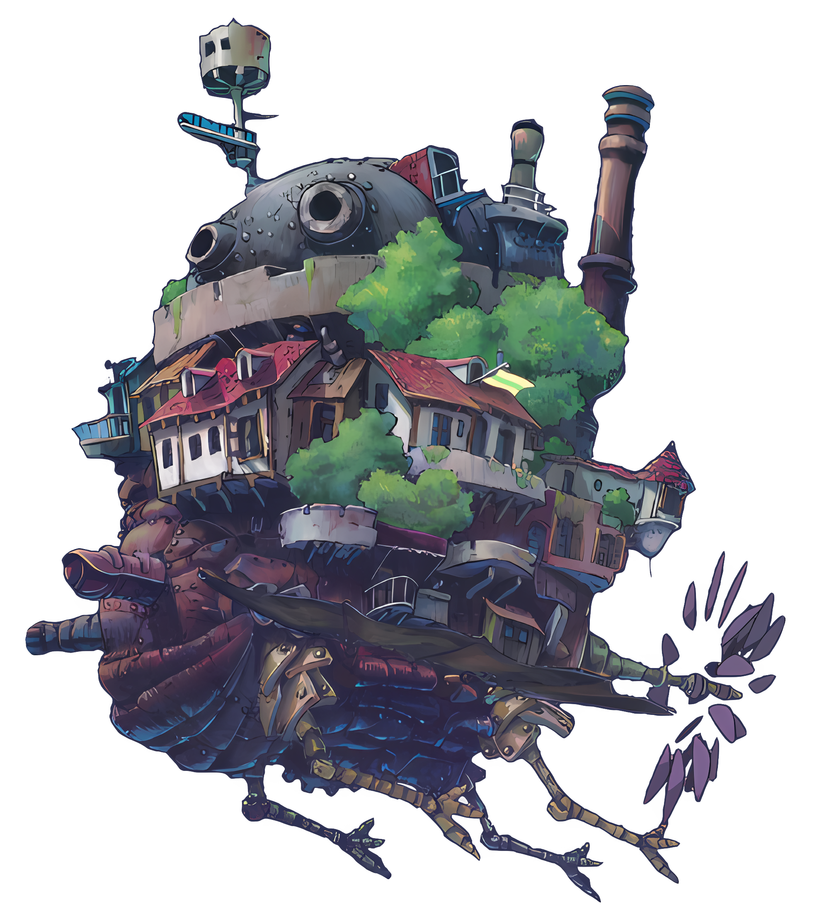

### hello, i am slime. ⎛>︶<⎞

i use **`next.js`**, **`flutter`**, **`sass`**, **`vercel`**, **`mongo`**, **`supabase`** to make things work (somehow)

### who am i

just a slime who writes code, loves music & gaming, spends free time spamming open-source with "weird" apps and websites

### building poke

 

### stats

